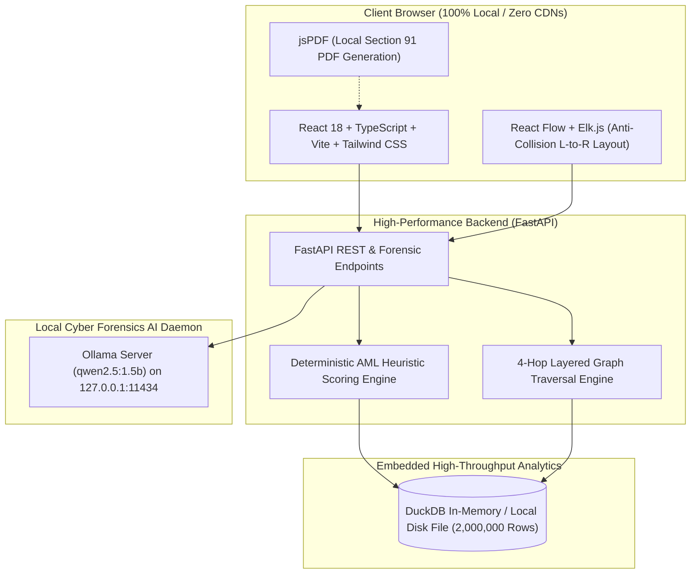

# Financial Fraud Network Tracer (Operation Abhedya-Chakra) - Team Matrix

[](https://fastapi.tiangolo.com/)
[](https://duckdb.org/)
[](https://reactflow.dev/)
[-000000.svg?style=flat)](https://ollama.com/)
[](#)

---

## 📌 Executive Overview

**Operation Abhedya-Chakra** addresses the critical bottleneck faced by Indian Law Enforcement Agencies (LEAs), State Cyber Cells, and Financial Intelligence Units (FIUs) during live financial fraud investigations: **money mule syndicates disperse cyber-extortion proceeds across multi-hop layered banking networks within minutes of deposit**, rendering manual branch notices and spreadsheet audits ineffective.

**Financial Fraud Network Tracer** is an ultra-low latency, 100% offline intelligence workbench designed to process massive transaction journals (2,000,000+ records), execute 4-hop multi-layer graph traversals in milliseconds, uncover smurfing and velocity pass-through anomalies, and autonomously generate statutory **Section 91 CrPC Freezing Directives** and formal **Police Case Diaries / First Information Reports (FIR)** via local LLM inference with zero cloud compute exposure.

---

## 🏛 Architecture & Tech Stack



### Technical Stack Details
* **Analytical Engine:** **DuckDB v1.5+** (Embedded vectorized C++ OLAP engine utilizing columnar execution, memory-mapped disk storage, and zero external database dependencies).
* **Backend Framework:** **FastAPI (Python 3.10–3.14)** with Uvicorn ASGI server, asynchronous endpoints, and deterministic heuristic algorithms.
* **Frontend Visualization:** **React 18**, **@xyflow/react (React Flow)**, **elkjs (Eclipse Layout Kernel)** for layered anti-collision layout, **Lucide Icons**, and **Tailwind CSS**.
* **AI & NLP Module:** **Ollama** running locally with **Qwen 2.5 (1.5B)** for zero-telemetry statutory legal drafting and multi-turn investigative memory.
* **Evidentiary Export:** **jsPDF** for client-side confidential legal notice generation, plus custom RFC 4180 CSV export for isolated syndicate data.

---

## ⚡ Key Capabilities & Problem Statement Compliance

### 1. Ultra-Fast Big Data Ingestion (2,000,000+ Transactions)
* **DuckDB Vectorized Stream Engine:** Processes 2M raw rows in under 3 seconds without Out-Of-Memory (OOM) failures or browser lockups.
* **Dynamic Schema Inference:** Automatically normalizes diverse banking formats (sender, receiver, amount, timestamps, IFSC, device types, IPs, transaction narrations).
* **Pre-Computed Risk Cache:** Asynchronously generates the `suspicious_cache` table upon ingestion for instant detection queries.

### 2. Multi-Hop Graph Traversal Engine (Hop -1 to Hop 4)
* **Under 0.5-Second Execution:** Queries and parses 4 full layers of downstream fund movements across millions of rows in $\approx 350\text{ ms}$ (well below the 2-second benchmark).
* **Layer Definitions:**
  * **Hop -1 (Source of Funds):** Inbound victim deposits and feeder accounts.
  * **Hop 0 (Target Hub Anchor):** Primary investigated suspect account.
  * **Hop 1 (Primary Relay Mules):** Immediate layer of velocity transfer accounts.
  * **Hop 2 (Distributor Accounts):** Secondary fragmentation layer breaking sums into smaller tranches.
  * **Hop 3 (Aggregation Layer):** Intermediary consolidation nodes.
  * **Hop 4 (Terminal Cash-Out):** Final withdrawal exit points.
* **Cycle Prevention:** Visited-set graph path tracking stops infinite circular fund loops.

### 3. Refined AML Heuristics (0–100 Risk Index, Zero False Positives)
* **Strict Scoring Matrix (Capped at 99%):**
  * **+50 Points:** High Wash Ratio (>90% funds dispersed within 24 hours of receipt).
  * **+20 Points:** Fan-Out Topology (Out-Degree $\ge 3$ distinct recipients).
  * **+15 Points:** Structuring / Smurfing Threshold (Amounts clustered in the ₹49,000–₹49,999 regulatory threshold).
  * **+15 Points:** Nocturnal Dispersal (Transactions executed during 01:00 AM – 05:00 AM window).
* **Strict $\ge 70$ Threshold:** The main suspicious activity ledger filters exclusively for actual suspect hubs ($\text{risk\_score} \ge 70$). Pure receivers, victim feeders, and legitimate accounts are categorized as `Normal Account` or `Feeder (Victim)` with `LOW` risk.
* **Metadata Fingerprinting:** Actively logs telemetry indicators (`Web_Emulator`, `Linux_Script`, proxy/VPN IP ranges `185.x.x.x` and `194.x.x.x`).

### 4. Graph UI & Evidentiary Controls
* **Elk.js Layered Anti-Collision Layout:** Left-to-right orthogonal hierarchy prevents node overlapping and text clipping.
* **Full Route Tracing (`findPathToRoot`):** Clicking or hovering over any downstream node dynamically traces the entire route back to the root anchor; on-path nodes/edges illuminate while unrelated branches dim to $10\%$ grayscale.
* **15-Day Temporal Playback Scrubber:** Interactive timeline slider with chronological autoplay, variable speeds (0.5x, 1x, 2x, 5x), and live date-range filtering.
* **Syndicate Subgraph Isolation & CSV Export:** One-click extraction of the active node's entire reachable syndicate to a clean forensic CSV file (`Syndicate_Data_{id}.csv`).

### 5. Offline AI Investigator & Statutory Legal Automation
* **Autonomous Section 91 CrPC Freezing Notices:** Instantly drafts formal debit-freeze directives citing bank branch managers, statutory 24–48h compliance requirements, and transaction totals with a 1-click **Download PDF** button.
* **Bulk Syndicate Network Freeze:** Drafts consolidated statutory notices covering up to dozens of downstream mule accounts simultaneously.
* **Statutory Police Case Diary / FIR Generation:** Formally structures First Information Reports under Section 154 CrPC read with Section 91 CrPC and IT Act Sec 66D.
* **Multi-Turn Conversational Memory:** Remembers investigated accounts and context across conversation turns using local Ollama chat history.

### 6. Strict Air-Gapped / Zero-Cloud Operation
* Zero cloud compute required; runs on air-gapped forensic laptops.
* No external CDNs, Google Fonts, or cloud analytics — 100% local assets.

---

## 🚀 Setup & Execution Guide

### Prerequisites
1. **Python 3.10 - 3.14**
2. **Node.js 18+ & npm**
3. **Ollama** ([Download Ollama](https://ollama.com/)) with model `qwen2.5:1.5b`

---

### Step 1: Start the Local AI Daemon (Ollama)
Open a terminal and ensure Ollama is serving locally with the required model:
```bash
# Pull the optimized forensic model
ollama pull qwen2.5:1.5b

# Start the Ollama server (listens on http://127.0.0.1:11434)
ollama serve
```

---

### Step 2: Start the FastAPI Backend
In a second terminal window, navigate to the `backend` directory, activate your virtual environment, and launch Uvicorn:
```bash
cd backend

# Create virtual environment (if not already created)
python -m venv .venv

# Activate virtual environment (Windows PowerShell)
.\.venv\Scripts\Activate.ps1
# (Or on Linux/macOS: source .venv/bin/activate)

# Install required dependencies
pip install -r requirements.txt

# Start the FastAPI server on port 8000
python -m uvicorn main:app --host 127.0.0.1 --port 8000
```
* Backend API Documentation: `http://127.0.0.1:8000/docs`
* Health Check: `http://127.0.0.1:8000/api/health`

---

### Step 2.5: Provision Officer Accounts (Offline CLI)
Because this is a law enforcement tool, there is no public signup page. Accounts are provisioned strictly via terminal:
```bash
# In the backend directory:
python add_officer.py
# (Or pass credentials directly)
python add_officer.py officer_admin "Cyber@Cell2026"
```
* Pre-configured evaluation account:
  * **Username:** `officer_admin`
  * **Password:** `Cyber@Cell2026`

---

### Step 3: Start the React Frontend
In a third terminal window, navigate to the `frontend` directory and start the Vite dev server:
```bash
cd frontend

# Install Node modules
npm install

# Start Vite development server
npm run dev
```
Open your browser and navigate to:
```
http://localhost:5173
```
Log in using your provisioned officer credentials to access the investigative workbench.


---

### Step 4: Ingest Dataset & Start Investigation
1. Drag and drop any large banking transaction CSV (up to 2,000,000+ rows) into the Ingestion Dropzone.
2. The DuckDB engine completes ingestion in $<3$ seconds and displays the top flagged mule hubs.
3. Click **"Track"** on any account (e.g. `ICIC10000446` or `SBIN10019943`) to render the full 4-hop money trail graph.
4. Click any node to open the **Account Forensic Profile**, review counterparties, click **"Freeze Downstream Network (Bulk)"**, or click **"Ask AI"** to initiate forensic chat.
5. In the AI Chat, type `"generate fir for this account"` or `"scan top suspect"` to generate complete statutory Police Case Diaries.

---

## 🔒 Confidentiality & Law Enforcement Notice
This software is developed strictly for hackathon demonstration, cybersecurity forensics research, and law enforcement investigative workflows. All simulated account IDs, IFSC codes, and transaction narratives generated during testing are fictitious and used solely for algorithm benchmarking.
